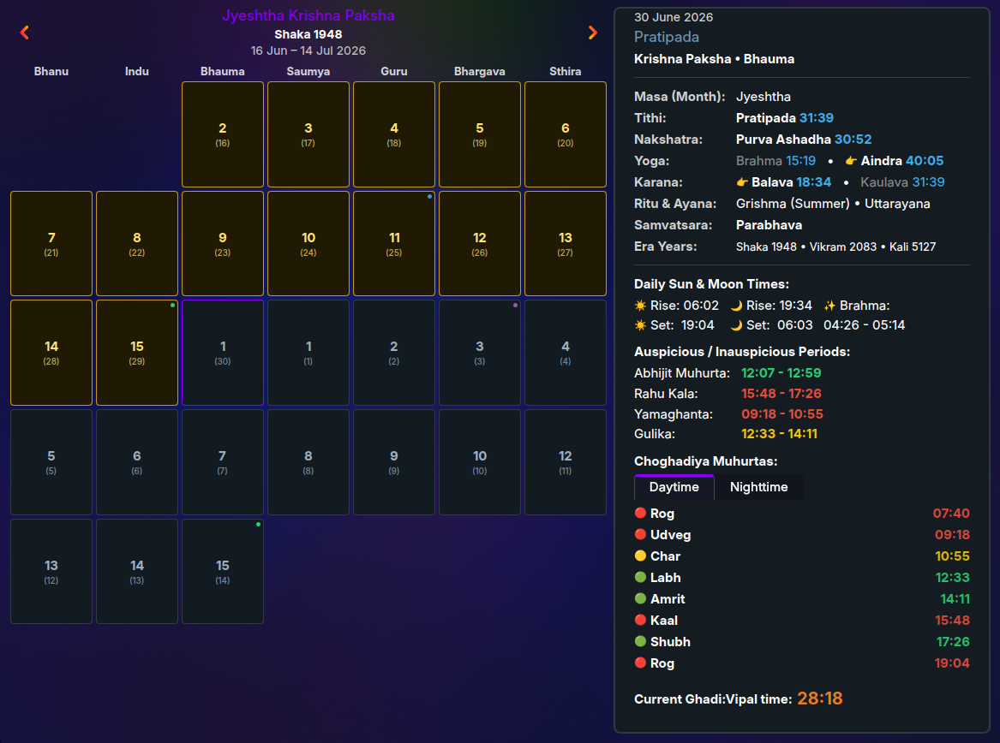
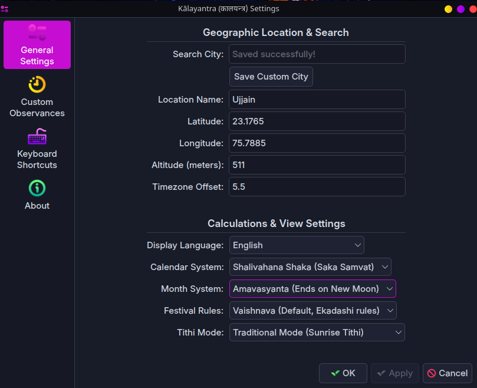
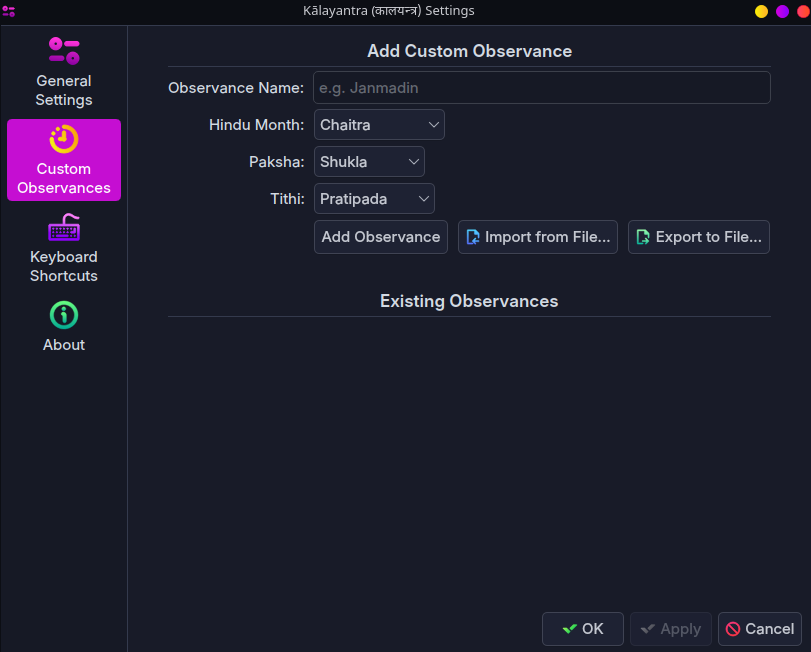

# Kālayantra (कालयन्त्र)

Kālayantra is a native KDE Plasma 6 widget and offline Panchanga (Hindu Calendar) that brings precise Hindu astronomical calculations directly to your desktop.

## Architecture (v2.0 Upgrade)

Kālayantra is built with a strictly decoupled modular design following separation of concerns:

- **Kalayantra**: The desktop app and panel widget wrapper for KDE Plasma 6.
- **Kalachakra**: The core Panchanga and astronomical calculation engine.
- **Kalotsavachakra**: The traditional Dharmaśāstra festival & ritual calculation engine.
- **Kalasetu**: The backend bridge / local API service daemon.
- **Kaladarshana**: The native user interface (UI) built using QML, Kirigami, and QtQuick.
- **Kalakosha**: The static knowledge repository (metadata, coordinates, translations).

## Features

- **Precise Lunisolar Astronomical Engine:** Powered by the local **Kalachakra** engine using the Swiss Ephemeris (`pyswisseph`).
- **Native KDE Plasma 6 Experience:** Built using QtQuick, Kirigami and QML for seamless Plasma integration.
- **Traditional & Astronomical Display Modes:**
  - **Traditional Mode:** Panchanga elements are determined using the sunrise rule. If an element survives until the next sunrise, only that element is displayed; otherwise both the current and next elements are shown.
  - **Astronomical Mode:** Displays the currently active Panchanga element along with upcoming transitions.
- **Dynamic Hindu Month Navigation:** Hindu lunar months (e.g. *Jyeshtha Masa*) are treated as the primary calendar, with Gregorian dates shown as secondary references.
- **Detailed Panchanga Information:**
  - Tithi
  - Vaara
  - Nakshatra
  - Yoga
  - Karana
  - Masa
  - Paksha
  - Ritu
  - Ayana
  - Samvatsara
  - Shaka, Vikrama and Kali Year
- **Live Ghadi–Vipal Clock:** Real-time traditional Hindu time calculation based on local sunrise.
- **Daily Solar & Lunar Events:**
  - Sunrise
  - Sunset
  - Moonrise
  - Moonset
- **Auspicious & Inauspicious Times:**
  - Brahma Muhurta
  - Rahu Kala
  - Yamaganda
  - Gulika Kala
  - Abhijit Muhurta
  - Day & Night Choghadiya
- **Authentic Festival Engine:** Powered by **KalotsavaChakra**, implementing traditional Dharmaśāstra-based festival calculations rather than a generic sunrise rule.
- **Supported Festivals:**
  - Major Hindu festivals
  - All Ekadashis (with traditional names)
  - Sankashti Chaturthi
  - All Sankrantis
  - Smarta & Vaishnava calculation modes
- **Offline City Search:** Built-in searchable database of cities with support for locally cached custom locations.
- **Custom Lunar Observances:** Create, edit, delete, import and export recurring tithi-based personal observances such as birthdays, anniversaries and vratas.
- **Dynamic Calendar Indicators:**
  - 🔵 Ekadashi
  - 🟠 Sankranti
  - 🟣 Sankashti Chaturthi
  - 🟢 Major Festivals
  - 🟡 Custom Observances
- **Traditional Panchanga Time Formatting:** Events occurring after midnight are displayed using the traditional 24+ hour notation (e.g. `27:15`, `31:42`) until the next sunrise.
- **Panel Tooltip:** Hovering over the widget displays Sunrise, Sunset, Moonrise, Moonset, Ghadi–Vipal, Nakshatra, Yoga, Karana and the current festival.
- **Multiple Calendar Systems:**
  - Shalivahana Shaka (Default)
  - Vikram Samvat (Chaitradi)
  - Vikram Kartak (Kartikadi)
- **Month Systems:**
  - Amavasyanta (Default)
  - Purnimanta
- **Localization:**
  - English
  - IAST Sanskrit
  - Devanagari
- **Offline & Privacy Respecting:** No cloud APIs, no Internet dependency, and all astronomical calculations are performed locally.

## Screenshots

### Panel Widget


### Calendar Popup



### Settings





## Installation

### Dependencies

Ensure you have python3 and the Swiss Ephemeris package installed on your system:

- **Arch Linux:** `sudo pacman -S python-pyswisseph` or install via pip: `pip3 install pyswisseph`
- **Fedora:** `sudo dnf install python3-pyswisseph` or `pip3 install pyswisseph`
- **Ubuntu/KDE Neon/Kubuntu:** `pip3 install pyswisseph`

### Clone the repository

```bash
git clone https://github.com/vvpai9/Kalayantra.git
cd Kalayantra
```

### Install script

Run the automated installer script:

```bash
chmod +x install.sh
./install.sh
```

This will:
1. Register and install the Plasmoid package using `kpackagetool6`.
2. Configure a systemd user service (`kalachakra.service`) to run the Python **Kalasetu** API bridge on port `8642`.
3. Enable and start the background service.

## License

GPL-3.0 License.
