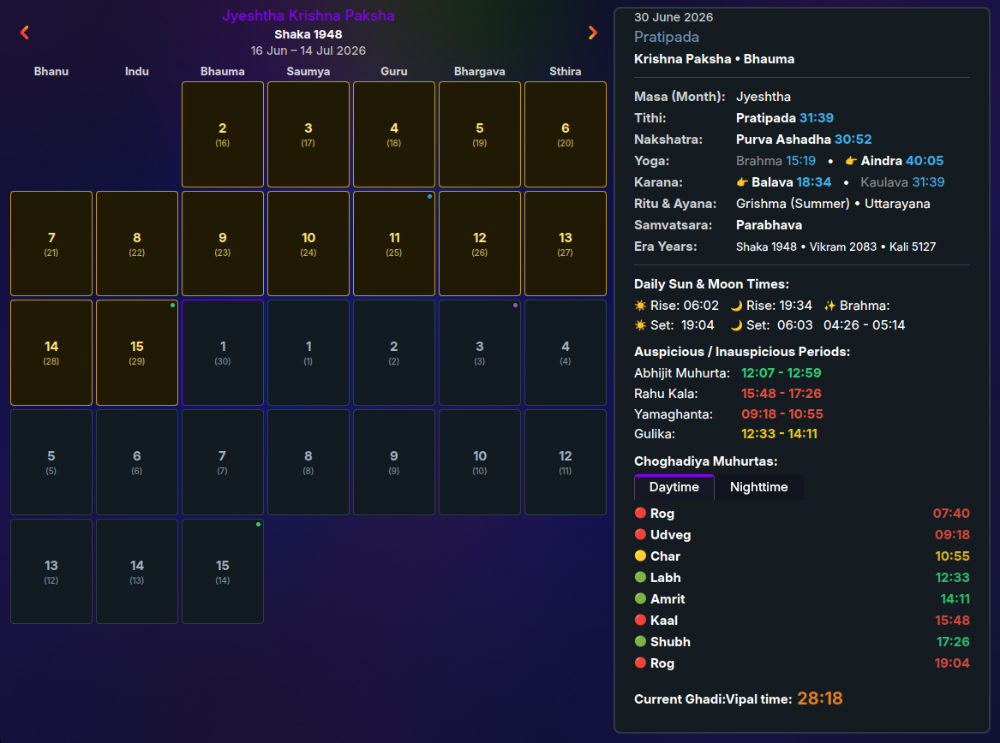
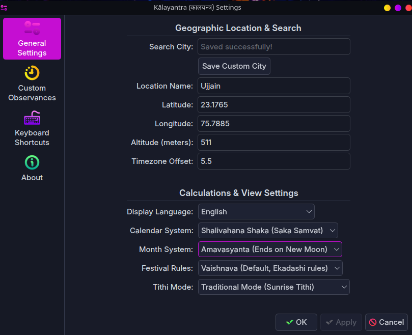

# Kālayantra (कालयन्त्र)

A native **KDE Plasma 6 widget** and **standalone Linux desktop app** that brings the traditional
Hindu *Panchanga* — with its full Jyotiṣa reasoning layers — entirely offline to your desktop.
Every calculation runs locally with the **Swiss Ephemeris**; nothing is sent to the cloud, no
account is required, and it always knows where it is.

**"Your Panchanga is unexplainable until it cites its sources."** Kālayantra doesn't just compute
a date — it builds a machine-readable **evidence graph** (KalaBodha), explains its own reasoning in
plain language (KalaMedha), and ships the curated knowledge and formulas behind every number
(KalaVidya). You can read the result, or you can read *why*.

---

## Architecture

| Module | Role |
|---|---|
| **KalaChakra** | Core Panchanga & Jyotiṣa calculation engine (Swiss Ephemeris). |
| **KalaUtsavachakra** | Festival & Vrata engine — Ekadashi rules, Kṣaya tithi, Sankranti, observances. |
| **KalaVartika** | Math & time utilities (julian days, sunrise, transitions, divisional math). |
| **KalaKosha** | Offline knowledge base — city registry, festival names, translations. |
| **KalaSetu** | Local HTTP/JSON daemon on `127.0.0.1:8642` — API, OpenAPI contract, CLI bridge. |
| **KalaBodha** | Structured Jyotiṣa reasoning layer over the chart — evidence graph, yogas, strength. |
| **KalaMedha** | Offline AI reading layer over the KalaBodha evidence graph — narrative, rankings, Q&A. |
| **KalaVidya** | Informational knowledge layer — curated concepts, formulas, examples, sources. |
| **Kaladarshana** | QtQuick / Kirigami UI front end (widget + standalone app). |

A systemd **user** service (`kalachakra.service`) runs the KalaSetu daemon on
`http://127.0.0.1:8642` and is always running after `./install.sh` — so the widget, the standalone
app, the `kalayantra-cli` toolhare, Excel, curl, Python and any browser can all query the same
offline engine.

## Features

### Panchanga engine

- **Precise Lunisolar engine** — every element computed locally with Swiss Ephemeris.
- **Traditional (Udaya) mode:** elements computed at sunrise; if one survives past the next
  sunrise only it is shown, otherwise side-by-side (widget shows sunrise tithi; info panel
  highlights the active one). **Astronomical (current) mode:** real-time elements + transitions.
- **`find_transition`** — exact transition moments for any five-limb element (tithi/vaara as
  timeline anchors; nakshatra, yoga, karana transitions).
- **Saura Solar Calendar:** solar-era system computes traditional solar months (Meṣa→Mīna) from
  the Sun's sidereal signs, tracks solar Shaka years, hides Pakshas, disables day transitions,
  and counts sequential solar days from the Sankranti moment.
- **Editable Gregorian date** (DD-MM-YYYY) with a "Today" shortcut and live
  `Kirigami.InlineMessage` validation. Impossible dates (31-Feb, leap-year errors etc.) are
  rejected everywhere with a clear message — in the UI before any request, and by the daemon
  with a readable HTTP 400 rather than a crash.
- **Dynamic Hindu month/year navigation** headers (e.g. `Jyeṣṭha Masa`, `Shaka 1948`).
- **Panchanga transition detector** for traditional (sunrise-anchored) and current modes.
- **Trilingual output** — English, IAST, Devanagari.

### Festivals & observances

- **Festival & Vrata engine** with classical rule strings — each festival record carries the
  `rule` that matched.
- **Kṣaya Tithi** detection with merging of custom observances / Vratas onto the lost day.
- **Ekadashi logic:**
  - *Vaishnava:* Ekadashi must begin before Arunodaya (96 min before sunrise), otherwise it is
    *viddha* and the fast moves to **Dvādaśī** (Mahādvādaśī / Atirikta Upavāsa).
  - *Smārta:* sunrise (Udaya-vyāpinī) rule with Vṛddha-Ekadashi handling.
- **Dynamic color-coded calendar dots** — 🔵 Ekadashi, 🟠 Sankranti, 🟣 Sankashti Chaturthi,
  💗 My Tithis, 🟢 major festivals/vratas — sized by event hierarchy.
- **My Tithis & anniversaries** — recurring traditional events with anniversary counts, plus
  Import/Export to local JSON.
- **Lunar recurring reminders** — desktop D-Bus notifications matched to Tithi / Paksha+Tithi /
  Masa+Paksha+Tithi / Nakshatra / Vara+Tithi / Sankranti / custom festivals at dynamic targets
  (Brahma Muhurta, sunrise, offset-before-sunrise, exact time), with caching.
- **Festival list** (`kalayantra-cli festivals`) and offline **city registry**
  (`kalayantra-cli search-city`).

### Kundali / Vargas / Dasha

- **Natal chart (Kundali)** — lagna, all nine grahas with rāśi, nakṣatra / pāda, bhāva, dignity,
  combust/retrograde status, plus the Vimshottari timeline.
- **Varga D1–D60** — all 18 divisional charts rendered (North / South / East Indian styles).
- **Vimshottari dasha** with balance — computed natively.
- **Expandable dasha tree** — tap the drill-down on a Mahādaśā row to reveal its Antardaśās,
  and on an Antardaśā row to reveal its Pratyantardaśās (each with dates and span); the
  currently running periods are highlighted and auto-expanded on compute.
- **Chara Karakas (Jaimini)** — the natural-significator sequence (Ātmakāraka → Dārākāraka) for the
  7- or 8-graha scheme, tabulated as *Graha | Degree | Karaka | Represents*; Rahe's degree is stored
  reversed per the 8-karaka rule so its karaka-longitude is correct.
- **Ghaṭaka Chakra** — each rāśi's *inauspicious* set (Ghat month, tithis, days, nakṣatra, yoga,
  karaṇa, prahara, and the male/female Ghat Candra positions) so new ventures can be avoided when
  these coincide with the lunar status.
- **Saved Kundalīs** — birth details can be saved under a name and reloaded with one click (Save /
  Load buttons in the chart form), or managed directly through the API (`/save_kundali`,
  `/list_kundalis`, `/load_kundali`, `/delete_kundali`). Only the birth parameters are stored; a
  chart is always freshly recomputed on load.

### Gochara (transits)

Hybrid of `/kundali` (natal) and `/gochara` (transit): computes the current transit position of
all nine grahas against a natal chart — rāśi, nakṣatra, pāda, longitude, dignity, retrograde —
plus the **special transits** (Sade Sati with phase, Ashtama Shani, Guru Gochara), next sign
changes)Skip, and intra-day transit conjunctions.

### Compatibility & Muhurta

- **Aṣṭakūṭa (Gun Milan)** — bride/groom compatibility scored across all kootas out of 36, with
  Nadi/Bhakoot dosha flags and cancellation rules.
- **Hora** — Chaldean hourly lords.
- **Muhūrta** — 30 daily muhūrtas with auspiciousness, plus Abhijit, Rahu Kāla, Gulika,
  Yama-ghanta, and Choghadiya / Hora segments.

### Knowledge layers

- **KalaBodha — Structured Jyotiṣa reasoning (Phase 10):** machine-readable evidence graph over
  the chart — Parashari + Jaimini *drishti*, same-rāśi conjunctions, **Graha Yuddha** (Bṛhat
  Jātaka rule: same sign within 1°, higher ecliptic latitude wins unless retrograde), classical
  status markers (Uccha / Neecha / Svakshetra / Moolatrikona / Vargottama / Digbala / Asta /
  Maargi / Vakri), a 13-yoga engine (Sunapha/Anapha/Durudhara, Pancha Mahapurusha, Gajakesari,
  Budhaditya, Chandra–Mangala, Neecha Bhanga, Vipareeta, Raja, Dhana, Adhi), an **evidence
  graph** (conclusion → factors → rule → source), a programmatic query API (*"Where is
  Shani?"*, *"Is Shani Asta/Vakri?"*, *"Shani aspects"*) and a **birth-time uncertainty**
  report.
- **KalaMedha — Offline AI reading (Phase 14):** deterministic rule-based natural-language layer
  over the KalaBodha evidence graph — lagna, per-graha examination, yogas, Vimshottari dasha;
  **explainable per-graha strength/weakness rankings** (scored & ranked with reasons); answers
  plain-language questions like *"Where is Shani?"*, *"Is Guru strong?"*, *"What does Guru
  aspect?"*, *"What is the current dasha?"* — every statement cited from the computed chart.
  Optional **local LLM hook** (Ollama via a pluggable provider registry) can enrich the reading
  with an `answer` and degrades gracefully back to the rule engine. Question-answering and the
  LLM hook are exposed through `GET /medha?question=…&llm=true` and
  `kalayantra-cli medha --question … --llm`; the desktop Analyse tab computes the
  deterministic rule-based reading only.
- **KalaVidya — Concepts & Formulas:** curated knowledge ships with the app — an informational
  knowledge layer (`GET /vidya`), no computation, no server-side AI, just curated knowledge.
  48 concepts across 13 categories (panchanga, time, sidereal frame, grahas, lagna, vargas,
  dashas, gochara, compatibility, muhurta, festivals, methods, reasoning), each with
  **trilingual** title/summary (English / IAST / Devanagari), a plain-language meaning, the
  **exact engine formula** for that concept (e.g. tithi = `(moon − sun) mod 360 / 12`), a worked
  example, the classical source, keywords and cross-references.

---

## Screenshots

### Panel Widget


### Calendar Popup



### Settings



## Installation

### Dependencies

- **python3** and the **Swiss Ephemeris** Python bindings:
  - **Arch Linux:** `sudo pacman -S python-pyswisseph` (or `pip3 install pyswisseph`)
  - **Fedora:** `sudo dnf install python3-pyswisseph` (or `pip3 install pyswisseph`)
  - **Ubuntu / KDE Neon:** `pip3 install pyswisseph`
- A Plasma 6 / Qt 6 environment for the widget; the engine and CLI work on any distribution.

### Install script

```bash
chmod +x install.sh
./install.sh
```

This will:
1. Register and install the Plasmoid package using `kpackagetool6`.
2. Configure a systemd **user** service (`kalachakra.service`) to run the **KalaSetu** daemon on
   port `8642`.
3. Enable and start the background service.
4. Install the standalone desktop app (`~/.local/share/kalayantra/`), an application-menu
   entry, and the Kālayantra **app icon** into your icon theme.
5. Install the `kalayantra-cli` command-line tool into `~/.local/bin/`.

## Standalone App

Kālayantra runs as a standalone Linux desktop application as well as a Plasma widget.

```bash
# From the repository checkout
./standalone/kalayantra-app

# Or launch it from your application menu after running ./install.sh
```

The app opens a resizeable window containing the full Kaladarshana interface. On startup it
adopts the location and calendar settings saved by the widget/engine (from `~/.config/kalayantra/`)
via the KalaSetu `/config` endpoint, so a city chosen in the widget is reflected in the app. The
`Kālayantra – <city>` title reflects the active city; the default is Ujjain.

## Command line (`kalayantra-cli`)

Every subcommand shares the common ephe options (`--lat --lon --alt --tz --ayanamsa`), which may
be omitted to use the daemon's saved coordinates. `--format text|json|csv` (text is the default
human-readable output), `--output FILE` and `--direct` (compute locally instead of asking the
daemon) are available everywhere.

```bash
# Today's Panchanga (uses the engine daemon, falls back to direct computation)
kalayantra-cli day

# A specific date
kalayantra-cli day 28-08-2026 --lang devanagari

# A whole month as CSV
kalayantra-cli month 2026 08 --format csv --output panchanga-2026-08.csv

# A date range
kalayantra-cli range --start 01-08-2026 --end 28-08-2026

# List all festival names
kalayantra-cli festivals

# Look up a city from the offline registry
kalayantra-cli search-city "Sringeri"

# Latest full-year CSV (daemon-mode delivers full precomputed calendars)
kalayantra-cli range --start 01-01-2026 --end 31-12-2026 --format csv --output year-2026.csv

# Kundali (natal chart), Hora, Muhurta, Analysis, KalaBodha, KalaMedha
kalayantra-cli kundali --date 15-06-1990 --hour 10 --minute 30 --lat 13.0827 --lon 80.2707 --tz 5.5 --ayanamsa lahiri
kalayantra-cli analysis --date 15-06-1990 --hour 10 --minute 30 --lat 13.0827 --lon 80.2707 --tz 5.5
kalayantra-cli bodha --date 15-06-1990 --hour 10 --minute 30 --lat 13.0827 --lon 80.2707 --tz 5.5 --lang iast
kalayantra-cli bodha --date 15-06-1990 --hour 10 --minute 30 --lat 13.0827 --lon 80.2707 --tz 5.5 --sensitivity
kalayantra-cli medha --date 15-06-1990 --hour 10 --minute 30 --lat 13.0827 --lon 80.2707 --tz 5.5
kalayantra-cli medha --date 15-06-1990 --hour 10 --minute 30 --lat 13.0827 --lon 80.2707 --tz 5.5 --question "Why is Guru strong?"
kalayantra-cli medha --date 15-06-1990 --hour 10 --minute 30 --lat 13.0827 --lon 80.2707 --tz 5.5 --llm

# KalaVidya — concepts & formulas (informational layer, no chart needed)
kalayantra-cli vidya                                    # full concept catalog
kalayantra-cli vidya tithi                              # one concept, in detail
kalayantra-cli vidya --category panchanga               # catalog, one category
kalayantra-cli vidya --search "sade sati"               # ranked keyword search
kalayantra-cli vidya tithi --lang devanagari            # trilingual titles

# Gochara (transits) against a natal chart
kalayantra-cli gochara --date 15-06-1990 --hour 10 --minute 30 --transit-date 12-09-2026 --lat 13.0827 --lon 80.2707 --tz 5.5

# Ashtakoota compatibility between two birth dates
kalayantra-cli ashtakoota --bride-year 1990 --bride-month 6 --bride-day 15 --bride-hour 10 --bride-minute 30 --bride-tz 5.5 \
  --groom-year 1992 --groom-month 3 --groom-day 8 --groom-hour 16 --groom-minute 45 --groom-tz 5.5

# Hora & Muhurta
kalayantra-cli hora --date 12-09-2026 --tz 5.5
kalayantra-cli muhurta --date 12-09-2026 --tz 5.5
```

Use `kalayantra-cli --help` and `kalayantra-cli <cmd> --help` for the full flag reference.

## HTTP API (`KalaSetu` daemon)

The engine daemon runs on `http://127.0.0.1:8642` and serves JSON/CSV locally. It is managed as a
systemd user service (`kalachakra.service`) so any tool — Excel, Python, curl, a browser — can
query the Panchanga engine locally. Response is UTF-8; CSV responses include a **BOM** so they open
directly in Excel.

### Conventions

| Item | Value |
|---|---|
| Base URL | `http://127.0.0.1:8642` |
| Default location | Ujjain (`lat=23.1765`, `lon=75.7885`, `alt=0`) |
| Default timezone | `tz=5.5` |
| Response | JSON; CSV via `format=csv` (UTF-8 with BOM) |

### Endpoints

#### `GET /day` — one day (Panchanga + festivals)

```bash
curl "http://127.0.0.1:8642/day?date=12-09-2026&lat=16.3067&lon=80.4365&tz=5.5&lang=en"
```

Returns the full day Panchanga: tithi, masa, nakshatra, yoga, karana, vaara, sunrise/sunset with
moonrise/moonset, festivals & observances, plus detail=true for the long-form report.

#### `GET /month` — a whole month

```bash
curl "http://127.0.0.1:8642/month?year=2026&month=9&lang=devanagari"
curl "http://127.0.0.1:8642/month?year=2026&month=9&format=csv" -o bhadrapada-2026.csv
```

#### `GET /range` — date ranges (bulk)

```bash
curl "http://127.0.0.1:8642/range?start=01-08-2026&end=28-08-2026"
curl "http://127.0.0.1:8642/range?start=01-01-2026&end=31-12-2026&format=csv" -o year-2026.csv
```

#### `GET /kundali` — natal chart

```bash
curl "http://127.0.0.1:8642/kundali?date=15-06-1990&hour=10&minute=30&lat=13.0827&lon=80.2707&tz=5.5&ayanamsa=lahiri"
```

Returns `lagna`, all nine grahas (longitude, rāśi, nakṣatra & pāda, bhāva, dignity, retrograde),
the D1–D60 `vargas`, the Chara Karakas (`karakas`, 7/8-graha schemes with degree in sign and what
each karaka represents), the Ghaṭaka Chakra (`ghatak`), `houses`, and the Vimshottari `mahadashas`
with balance.

#### Saved Kundalīs (birth profiles)

```bash
curl -X POST "http://127.0.0.1:8642/save_kundali" \
  -H "Content-Type: application/json" \
  -d '{"name":"Meera","date":"15-06-1990","hour":10,"minute":30,"lat":13.0827,"lon":80.2707,"tz":5.5,"ayanamsa":"lahiri"}'
curl "http://127.0.0.1:8642/list_kundalis"                       # all saved profiles
curl "http://127.0.0.1:8642/load_kundali?id=…"                   # one profile's birth fields
curl -X POST "http://127.0.0.1:8642/delete_kundali?id=…"         # remove a profile
```

Profiles only store the birth parameters (`name`, `date`, `hour`, `minute`, `lat`, `lon`, `alt`,
`tz`, `ayanamsa`); passing them back to `/kundali` recomputes a fresh chart. Stored in
`~/.config/kalayantra/kundalis.json`. The widget's Kundali form also exposes Save / Load buttons
that use these endpoints.

#### `GET /bodha` (and versioned alias `GET /api/v1/bodha`) — KalaBodha structured reasoning

```bash
curl "http://127.0.0.1:8642/bodha?date=15-06-1990&hour=10&minute=30&lat=13.0827&lon=80.2707&tz=5.5&sensitivity=true"
```

Returns the full `kundali` plus a `bodha` object with machine-readable evidence, graha drishti,
conjunctions, yogas, and the programmatic query API (`current_dasha`, etc.).

#### `GET /medha` (and versioned alias `GET /api/v1/medha`) — KalaMedha offline AI reading

```bash
curl "http://127.0.0.1:8642/medha?date=15-06-1990&hour=10&minute=30&lat=13.0827&lon=80.2707&tz=5.5"
```

Returns the full `kundali` plus a `medha` object with:

- `narrative` — deterministic, explainable reading (lagna, per-graha examination, yogas, dasha).
- `strengths` — the nine grahas **ranked with explainable scores** (reasons per graha),
  `strongest`/`weakest` and counted yogas.
- `meta` — engine name, language and whether the LLM hook was used.

Pass `question=…` to append an `answer`, and `llm=true` to try the optional local LLM hook (falls
back to the rule engine when no local model is reachable).

#### `GET /vidya` (and versioned alias `GET /api/v1/vidya`) — KalaVidya knowledge layer

```bash
curl "http://127.0.0.1:8642/vidya"                                        # full concept catalog
curl "http://127.0.0.1:8642/vidya?concept=tithi"                          # one concept, in detail
curl "http://127.0.0.1:8642/vidya?category=panchanga"                     # catalog, one category
curl "http://127.0.0.1:8642/vidya?q=sade+sati"                            # ranked keyword search
curl "http://127.0.0.1:8642/vidya?concept=tithi&lang=devanagari"          # trilingual titles
```

Returns the full `kundali` plus a `vidya` object...

Implements: `concept=…`, `category=…`, and ranked `q=…` search accepting IAST and Devanagari.

#### `GET /gochara` — Gochara (planetary transits)

```bash
curl "http://127.0.0.1:8642/gochara?date=15-06-1990&hour=10&minute=30&transit_date=12-09-2026&lat=13.0827&lon=80.2707&tz=5.5"
```

Hybrid of `/kundali` (natal) + transit: computes the nine transiting grahas against a natal chart —
rāśi, bhāva, degree, dignity and retrograde status — along with the next sign-changes and
special transit yogas (Sade Sati, Ashtama Shani, Guru Gochara).

#### `GET /ashtakoota` — Gun Milan compatibility

```bash
curl "http://127.0.0.1:8642/ashtakoota?date=15-06-1990&hour=10&minute=30&lat=13.0827&lon=80.2707&tz=5.5" \
  --data-urlencode "bride={\"year\":1990,...}" 
```

Ashtakoota (Gun Milan) scores the bride/groom match over all eight kootas out of 36, with
Nadi/Bhakoot dosha flags and cancellation rules.

#### Observances and reminders

- `GET /get_custom_observances` / `POST /save_custom_observance` /
  `POST /delete_custom_observance` / `GET /export_custom_observances` /
  `POST /import_custom_observances`.
- `GET /get_reminders` / `POST /save_reminder` / `POST /delete_reminder` /
  `GET /export_reminders` / `POST /import_reminders` / `GET /evaluate_reminders?date=…`.

#### `GET /config` and `GET /system_info`

- `GET /config` → last saved coordinates and calendar settings.
- `GET /system_info` → platform details of the running engine.

### JSON POST

Any endpoint accepts the same parameters as a JSON body:

```bash
curl -X POST "http://127.0.0.1:8642/range" \
  -H "Content-Type: application/json" \
  -d '{"start": "01-01-2026", "end": "31-12-2026", "lat": 16.3067, "lon": 80.4365, "tz": 5.5, "format": "csv"}'
```

## Testing

Run the complete regression suite (no network required; all calculations run locally):

```bash
python3 tests/test_calibrated.py   # calculation engine (488 tests)
python3 tests/test_kalabodha.py    # Jyotiṣa reasoning layer (204 tests)
python3 tests/test_apisetu.py      # HTTP API, CLI & public helpers (93 tests)
python3 tests/test_kalamedha.py    # KalaMedha offline AI layer (42 tests)
python3 tests/test_kalavidya.py    # KalaVidya concept knowledge layer (31 tests)
```

All five suites cover panchanga construction across calendar systems, festivals, Kundali/Vargas,
Dasha, Gochara, Ashtakoota, KalaBodha evidence answers, the full `/openapi.json` path surface, POST
bodies, the `kalayantra-cli` subcommands in `--direct` mode, and helpers such as
`find_transition`. Tests write only to a temporary HOME.

## License

GPL-3.0 License.
